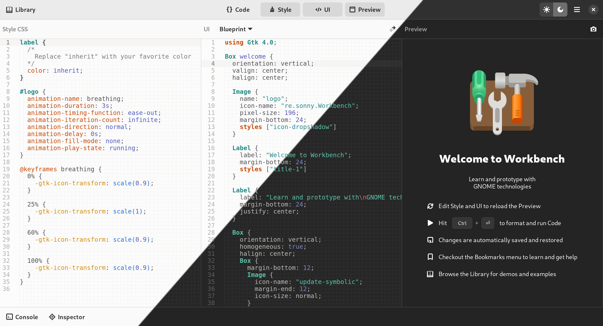

# Workbench

Playground for GNOME development

Workbench aims to provide a great developer experience for the following use cases

1. An application to learn GNOME development - learning by doing with an instant feedback loop
2. A stratchpad for experienced developers who want to try or prototype something quickly

Workbench will never be a full fledged IDE or code editor. I see it as the little brother of [GNOME Builder](https://apps.gnome.org/app/org.gnome.Builder/).

Features:

* Live GTK/CSS preview
* [GNOME JavaScript](https://gjs.guide/) for quick and easy scripting
* Syntax highlighting
* Opens `.js`, `.css` and `.ui` files
* Auto format
* [More to come](https://github.com/sonnyp/Workbench/issues)

Workbench is a work in progress, [feedback and help welcome](https://github.com/sonnyp/Workbench/discussions/new).

## Test

1. Install [GNOME Builder](https://apps.gnome.org/app/org.gnome.Builder/)
2. Open Builder and select "Clone Repository..."
3. Clone `https://github.com/sonnyp/Workbench.git`
4. Press the Run ▶ button

## Development

Use [GNOME Builder](https://apps.gnome.org/app/org.gnome.Builder/).

## Copyright

© 2022 [Sonny Piers](https://github.com/sonnyp)

## License

GPLv3. Please see [COPYING](COPYING) file.
